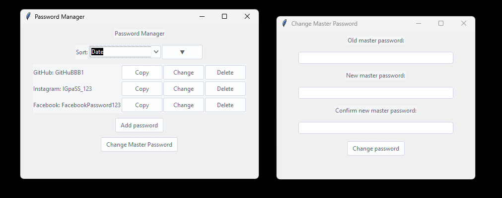

# Password Manager

A simple, yet effective password manager built with Python and Tkinter. I built it for myself out of distrust of other password manager software. It utilizes Fernet encryption and follows the master password concept.

## Features
- **Secure Password Storage:** Encrypts and stores passwords securely using Fernet encryption.
- **Master Password:** Access your vault with a single master password.
- **Add, Delete, and Change Passwords:** Easily manage your passwords.
- **Copy Passwords to Clipboard:** Quickly copy passwords to the clipboard.
- **Sort Passwords:** View passwords sorted by date or name.

## Installation and usage
1. Ensure Python 3.x is installed on your system.
2. Clone this repository or download the source code.
   ```sh
   git clone https://github.com/lanlebar/cinemate.git
   ```
3. Run main.py
   ```sh
   python main.py
   ```
## Dependencies
- `cryptography` for encryption and decryption.
- `bcrypt` for generating and verifying salts.
- `tkinter` for the GUI.

## Security
This application uses `cryptography`'s Fernet for secure encryption and decryption of passwords, ensuring that your data remains safe.


## Gallery
<p align="center">
  
</p>
<p align="center">
  
</p>
<p align="center">
  
</p>
<p align="center">
  
</p>