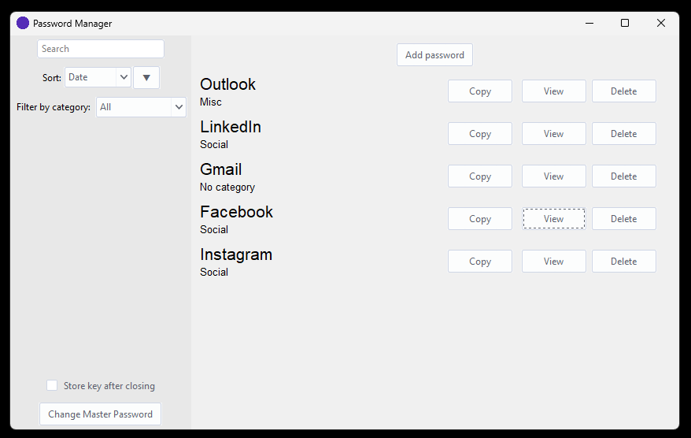
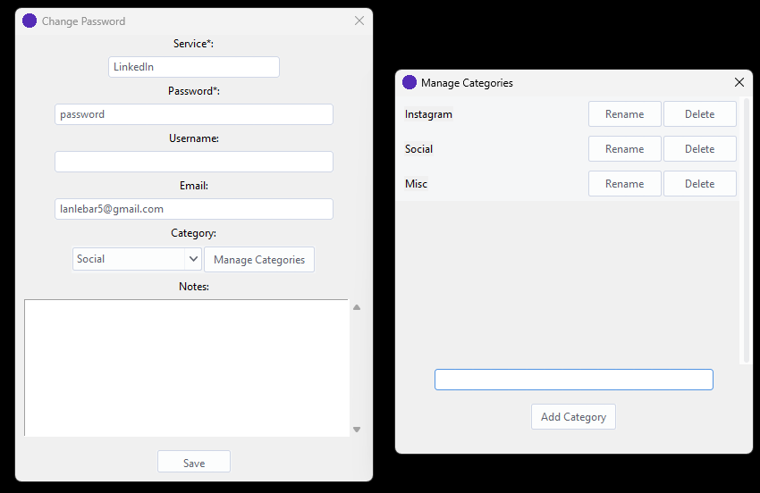
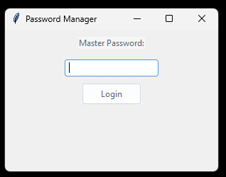
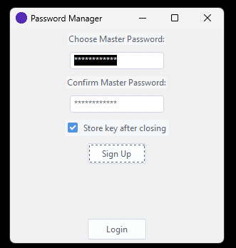

# Password Manager

A simple, yet effective password manager built with Python and Tkinter. I built it for myself out of distrust of other password manager software. It utilizes Fernet encryption and follows the master password concept.

## Features
- **Secure Password Storage** 
    - Store service name, passwords, username, email and notes securely for each account.
    - Organize stored passswords by category. 
- **Master Password** 
    - Access your vault with a single master password.
    - Master password is setup upon sign up.
    - Can also later be changed.
- **Password Managment**<br>
    - Sort, filter, and search through stored passwords.
    - Quickly copy passwords to the clipboard.
- **Encryption**
    - Secure storage using Fernet encryption
    - Passwords are encrypted using an encryption key derived from the master password via PBKDF2HMAC.
    - Choose whether the encryption key is stored on your device:
        - *Stored:* Less secure, but allows for manual decryption if you forget the master password.
        - *Not stored:* More secure, but requires you to remember the master password.


## Installation and usage
I built this password manager for myself, I didn't really have "mainstream" usage in mind so usage is a bit complex:
1. Ensure Python 3.x is installed on your system.
2. Clone this repository or download the source code.
   ```sh
   git clone https://github.com/lanlebar/password_manager.git
   ```
3. Set your salt
    - Generate salt, e.g.:
    ```
    import bcrypt
    print(bcrypt.gensalt())
    ```
    - Replace default salt value with the newly generated one - search for `"<your-salt-here>"` in encryption.py and manual-decryption.py.
        - Make sure you don't temper with salt afterwards!
3. Run main.py
   ```sh
   python main.py
   ```
## Dependencies
- `tkinter` for the GUI.
- `cryptography` for encryption and decryption.
- `Levenshtein` for the search algorithm


## Keyboard shortcuts
   - `Ctrl + N`: Add new password
   - `Ctrl + F`: Search
   - `<number>`: Set focus on corresponding password

## Gallery
<p align="center">
  
</p>
<p align="center">
  
</p>
<p align="center">
  
</p>
<p align="center">
  
</p>
